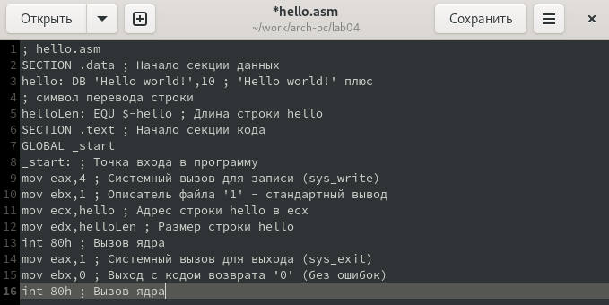
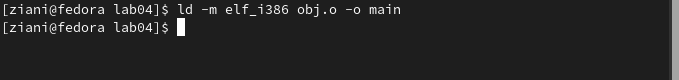

---
## Front matter
title: "Отчет по лабораторной работе №4"
subtitle: "Архитектура компьютеров"
author: "Зиани Сид Ахмед"

## Generic otions
lang: ru-RU
toc-title: "Содержание"

## Bibliography
bibliography: bib/cite.bib
csl: pandoc/csl/gost-r-7-0-5-2008-numeric.csl

## Pdf output format
toc: true # Table of contents
toc-depth: 2
lof: true # List of figures
lot: true # List of tables
fontsize: 12pt
linestretch: 1.5
papersize: a4
documentclass: scrreprt
## I18n polyglossia
polyglossia-lang:
  name: russian
  options:
	- spelling=modern
	- babelshorthands=true
polyglossia-otherlangs:
  name: english
## I18n babel
babel-lang: russian
babel-otherlangs: english
## Fonts
mainfont: PT Serif
romanfont: PT Serif
sansfont: PT Sans
monofont: PT Mono
mainfontoptions: Ligatures=TeX
romanfontoptions: Ligatures=TeX
sansfontoptions: Ligatures=TeX,Scale=MatchLowercase
monofontoptions: Scale=MatchLowercase,Scale=0.9
## Biblatex
biblatex: true
biblio-style: "gost-numeric"
biblatexoptions:
  - parentracker=true
  - backend=biber
  - hyperref=auto
  - language=auto
  - autolang=other*
  - citestyle=gost-numeric
## Pandoc-crossref LaTeX customization
figureTitle: "Рис."
tableTitle: "Таблица"
listingTitle: "Листинг"
lofTitle: "Список иллюстраций"
lotTitle: "Список таблиц"
lolTitle: "Листинги"
## Misc options
indent: true
header-includes:
  - \usepackage{indentfirst}
  - \usepackage{float} # keep figures where there are in the text
  - \floatplacement{figure}{H} # keep figures where there are in the text
---

# Цель работы

Освоение процедуры компиляции и сборки программ, написанных на ассемблере NASM.

# Выполнение лабораторной работы
### 1

Создаю каталог для работы с программами на языке ассемблера NASM.

{#fig:001 width=70%}

### 2
Перехожу в созданный каталог.

{#fig:001 width=70%}

### 3
Создаю текстовый файл с именем hello.asm

{#fig:001 width=70%}

### 4
Открываю этот файл с помощью текстового редактора gedit.

{#fig:001 width=70%}

{#fig:001 width=70%}

### 5
NASM превращает текст программы в объектный код.

{#fig:001 width=70%}

### 6
Полный вариант командной строки nasm выглядит следующим образом:

{#fig:001 width=70%}

### 7
Чтобы получить исполняемую программу, объектный файл необходимо передать на обработку компоновщику:

{#fig:001 width=70%}

### 8
Ключ -o с последующим значением задаёт в данном случае имя создаваемого исполняемого файла.

{#fig:001 width=70%}

### 9
Запуск исполняемого файла.

{#fig:001 width=70%}

# Самостоятельная работа
### 1
В каталоге ~/work/arch-pc/lab04 с помощью команды cp

{#fig:001 width=70%}

### 2
С помощью текстового редактора gedit ввожу изменения в тексте программы в файле lab04.asm вместо Hello world! ввожу Бердыев Даянч.

{#fig:001 width=70%}

### 3
Оттранслирую полученный текст программы lab04.asm в объектный файл. Выполняю
компоновку объектного файла.

{#fig:001 width=70%}

### 4
Копирую файлы hello.asm и lab04.asm в локальный репозиторий в каталог ~/work/study/2023-2024/"Архитектура компьютера"/arch-pc/labs/lab04/.

{#fig:001 width=70%}

{#fig:001 width=70%}

{#fig:001 width=70%}

# Выводы

В ходе выполнения этой лабораторной работы я освоил процедуру  компиляции и сборки программ, написанных на ассемблере NASM.

::: {#refs}
:::
